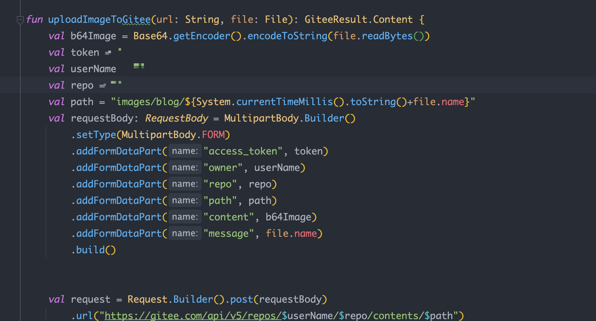

# typecho2hugo

将 typecho 博客内容转为 hugo 需要的 markdown，并将原来的图片上传到图床

## 使用方法

**数据无价，即是转换完成也请做好备份**

### 连接 typecho 数据库

> 因为我用的是 sqlite 如果你同样也是 sqlite 将数据库放在/data/目录即可

使用 Mysql 的修改`DatabaseFactory`中 JDBC 配置

### 修改图床配置

目前是将图片上传到 gitee，修改下面的配置即可  

如果需要其他图床，也可以修改`uploadImageToGitee`方法

我使用的是`PaperMod`主题，如果你使用的是其他主题，并且对发布文章有特殊配置，可以修改`WriteFiles`
中的`buildString`方法

   

转换后的效果 https://apkdv.com/

